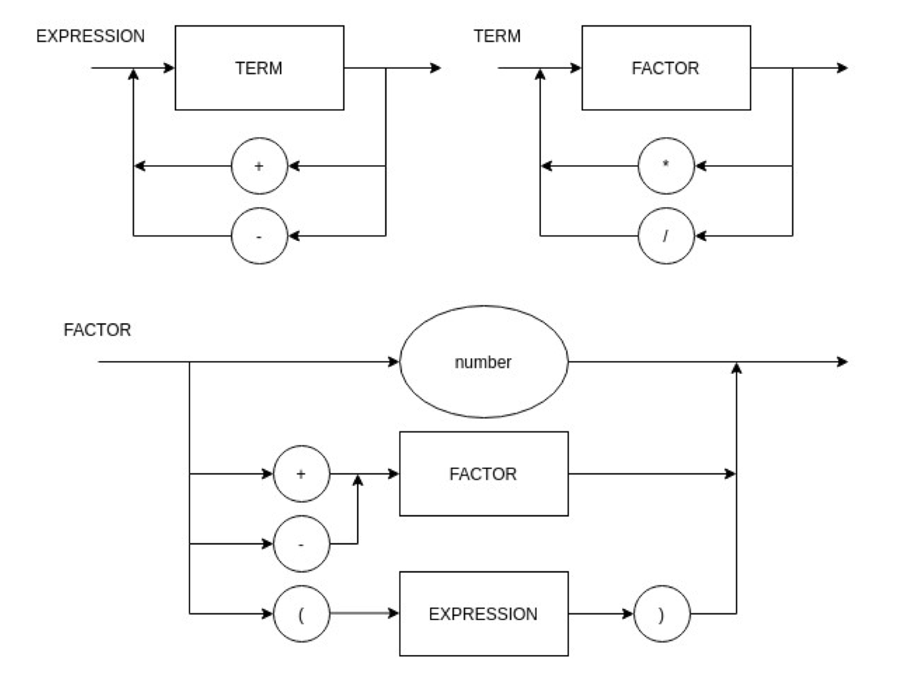

# Compilador

 - Para rodar : ``` python main.py exemplo.php ```
 - Comentários: Abrir com `/*` , e fechar com `*/`
 - Inserir a conta(1+2) no arquivo exemplo.php

### Diagrama sintático:



### EBNF:


`EXPRESSION = TERM, {("+" | "-"), TERM}; `

`TERM = FACTOR, {("*" | "/"), FACTOR} ;`

`FACTOR = NUMBER | ("+" | "-"), FACTOR | "(",EXPRESSION,")" ;`

`NUMBER = DIGIT, {DIGIT} ; `

`DIGIT = 0 | 1 | ... | 9 ;`
