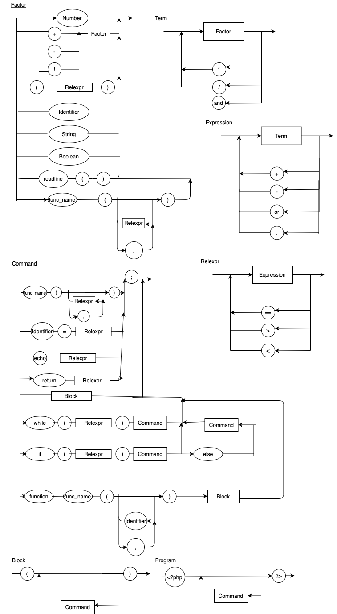

# Compilador

 - Para rodar : ``` python main.py exemplo.php ```
 - Comentários: Abrir com `/*` , e fechar com `*/`
 - Para criar um bloco abrir chaves '{'
 - Inserir comandos como echo(para imprimir valor) ou assignment(atribuir valor a variável, exemplo: '$x = 10;')
 - Sempre terminar um comando com ';'
 - Fechar o bloco com chaves '}'
 - Blocos podem ser criados dentro de outros blocos.

### Diagrama sintático:



### EBNF:

`BLOCK = "{", { COMMAND }, "}" ;`

`COMMAND = ( λ | ASSIGNMENT | PRINT), ";" | BLOCK ;`

`ASSIGNMENT = IDENTIFIER, "=", EXPRESSION, ";" ;`

`PRINT = "echo", EXPRESSION, ";" ;`

`EXPRESSION = TERM, {("+" | "-"), TERM}; `

`TERM = FACTOR, {("*" | "/"), FACTOR} ;`

`FACTOR = NUMBER | ("+" | "-"), FACTOR | "(",EXPRESSION,")" | IDENTIFIER ; IDENTIFIER = "$", LETTER, { LETTER | DIGIT | "_" };`

`LETTER = ( a | ... | z | A | ... | Z ) ;`

`NUMBER = DIGIT, {DIGIT} ; `

`DIGIT = 0 | 1 | ... | 9 ;`
